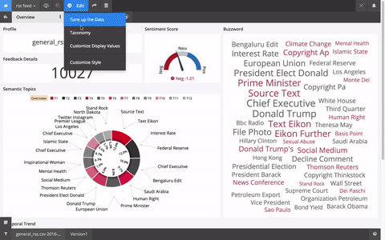

Advanced Options
================

Advanced options allow users to customize the way data is processed. These options are not always needed, but there are some scenarios in which they are very useful. For example:

Stopwords
~~~~~~~~~

Signals provides an out-of-the-box list of stopwords that include the main commonly used non-informative words such as: "the", "an", "I", etc.

You can filter out additional words on a per-data-source level to cut through some of the noise in the text by adding them to a stopword list as outlined below.

For example, RSS news feeds typically contain the same few sentences at the end of every article::

   Reporting By Laila Bassam in Aleppo and Tom Perry, John Davison and Lisa Barrington in Beirut;

   Writing by Angus McDowall in Beirut, editing by Peter Millership

Appears at the end of every news article in some publications. "Reporting By" and "Writing By" will likely be identified as Buzzwords. These terms could potentially link unlrelated documents since they aren't related to the article topics.

To suppress the noise caused by these terms, in the edit menu, click "Tune up data" and select the terms that are non-informative.

When finished click submit and your data will begin reprocessing with the feedback you've provided.

Junk/Spam
~~~~~~~~~

Creating a Junk/Spam list can be useful in many different datasets

For example in Twitter data if there is any spam, it will quickly be identified through the visualization. Users can choose to filter out the spam and reprocess the data, indicating to the :doc:`signalsanalyticsengine` that the matching documents should be ignored when processing (generating buzzwords and categories).

.. Note:: Spam is typically identified in two ways:
          

          1. A specific user in your dataset is posting junk content - in this case, you can simply select the user to ignore.
          

          2. A specific message has gotten picked up and re-posted by many different users - in this case, you can select the text that is unique to that message and it will be filtered out based on the content.

This is just one example, but as you can see it is generalizable to many other data-types.

Sentiment
~~~~~~~~~

Customizations may be needed is in sentiment scoring in some scenarios.

Signals Provides an out-of-the-box sentiment package that is trained on a breadth of data sources.

Certain terms are generally neutral, but when used in the context of a specific data-set or industry, always have a sentiment associatd with them. Or vise-versa, some terms are very negative generally, but are actually commonly used industry lingo among certain data-sets.

Taxonomy
~~~~~~~~

Signals supports importing existing taxonomies you have, or you can easily build your own from the ground up. The in-dashboard taxonomy editor allows you to tweak your taxonomy as you analyze your data. Drag and drop buzzwords into your label logic to increase your coverage of existing categories, or as you find new categories.

.. image:: taxonomyeditor.png

