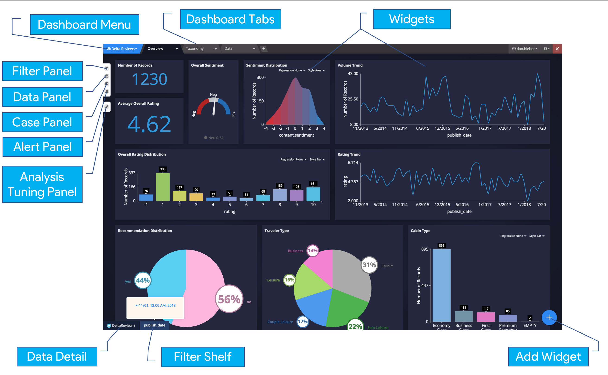

Creating a Dashboard
====================

.. image:: signalsgif1.gif

The dashboard interface is extremely flexible, allowing dashboards to be used for both passive monitoring as well as for active deep-dive or root-cause analysis.

Dashboards are interactive and allow you to visualize and pivot your data on multiple facets, analyzing them holistically or granularly. A Dashboard can hold multiple datasets for disparate data sources.

Dashboards are made up of widgets, or custom visualizations of your data. A dashboard can be split into multiple tabs to create focus areas within your dashboard.

To create a new dashboard, from the homepage, click on the New Dashboard icon:

.. image:: newdashboard.png

Anatomy of a Dashboard
------------------------

Dashboard Menu
^^^^^^^^^^^^^^^^^

*Sharing* - Share a dashboard with another user or with a group. See :ref:`this section <share>` on sharing and groups.

*Save as* - This will create a duplicate copy of your dashboard, allowing you to modify the visuals without changing the original.

.. note:: Dashboard copies will not make a copy of the data source. Any changes to the underlying data and/or analyses will affect the original dashboard.

*Play* - "Play" allows you to set a timer to automatically page through every tab on a loop. This is very useful for displaying dashboards on a tv in common areas for real-time monitoring.

*Export* - This exports a template file of your dashboard which can be applied as a template when creating a new dashboard. This is mainly used only when switching between Stratifyd environments/subdomains.

*Tools* - Tools allows you to open up different views from inside your dashboard:

 - Tuning mode: Opens the tuning panel where you can fine tune your model analysis results
 - Compare with: Allows you to pick another dashboard (can be the same one) to compare in a side-by-side view
 - Taxonomy: Opens the taxonomy editor for interactive editing of the taxonomy from inside the dashboard
 - Mobile Device Simulator: Allows you to select different screen resolutions on different devices to see how your dashboard will look

*Properties* - This is where you can set information about the dashboard as well as control the look and feel. "Type" allows you to indicate that the dashboard should be a template.

Dashboard Tabs
^^^^^^^^^^^^^^^^^

A dashboard can contain as many or as few tabs as desired. Tabs are there to help the designer organize visualizations into logical or intuitive groups based on the analysis context.

To add a tab, simply click the |newtab| button in the tab menu:

.. |newtab| image:: newtab.png
  :scale: 70

Options can be set at a tab level by hovering over the menu icon on your tab:

.. image:: taboptions.png

Clicking on the edit button will bring up the Tab Detail menu:

.. image:: tabdetail.png

By default, the filters from every tab are tied together. Users have the option to set a local query to merge with global queries or to override global queries with a local query. In next chapter, :doc:`analysis`, this is discussed in detail.

Filter Panel
^^^^^^^^^^^^^^

.. image:: filterpanel.png

Data Panel
^^^^^^^^^^^^^^

.. image:: datapanel.png

Case Panel
^^^^^^^^^^^^^

.. image:: casepanel.png

Alert Panel
^^^^^^^^^^^^^^^^

.. image:: alertpanel.png

Analysis Tuning Panel
^^^^^^^^^^^^^^^^^^^^^^

Data Detail
^^^^^^^^^^^^^^

Filter Shelf
^^^^^^^^^^^^^^^

Widgets
^^^^^^^^^^^

.. toctree::
  :maxdepth: 2

  widgeteditor
