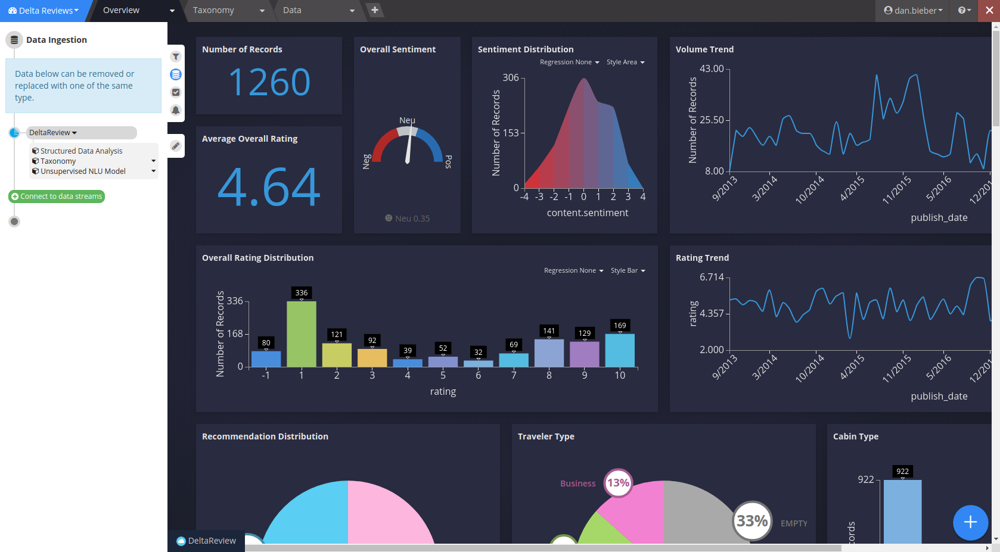

Creating a Dashboard
====================

.. image:: signalsgif1.gif

The dashboard interface is extremely flexible, allowing dashboards to be used for both passive monitoring as well as for active deep-dive or root-cause analysis.

Dashboards are interactive and allow you to visualize and pivot your data on multiple facets, analyzing them holistically or granularly. A Dashboard can hold multiple datasets for disparate data sources.

Dashboards are made up of widgets, or custom visualizations of your data. A dashboard can be split into multiple tabs to create focus areas within your dashboard.

To create a new dashboard, from the homepage, click on the New Dashboard icon:

.. image:: newdashboard.png

Anatomy of a Dashboard
========================

.. image:: dashboardanatomy.png

Dashboard Menu
^^^^^^^^^^^^^^^^^

.. image:: dashboardmenu.png

Dashboard Tabs
^^^^^^^^^^^^^^^^^

A dashboard can contain as many or as few tabs as desired. Tabs are there to help the designer organize visualizations into logical or intuitive groups based on the analysis context.

To add a tab, simply click the |newtab| button in the tab menu:

.. |newtab| image:: newtab.png
  :scale: 70

Options can be set at a tab level by hovering over the menu icon on your tab:

.. image:: taboptions.png

Clicking on the edit button will bring up the Tab Detail menu:

.. image:: tabdetail.png

By default, the filters from every tab are tied together. Users have the option to set a local query to merge with global queries or to override global queries with a local query. In next chapter, :doc:`analysis`, this is discussed in detail.

Filter Panel
^^^^^^^^^^^^^^

Data Panel
^^^^^^^^^^^^^^

Case Panel
^^^^^^^^^^^^^

.. image:: casepanel.png

Alert Panel
^^^^^^^^^^^^^^^^

.. image:: alertpanel.png

Analysis Tuning Panel
^^^^^^^^^^^^^^^^^^^^^^

.. image:: analysistuningpanel.png

Data Detail
^^^^^^^^^^^^^^

Filter Shelf
^^^^^^^^^^^^^^^

Widgets
^^^^^^^^^^^

.. toctree::
  :maxdepth: 2

  widgeteditor
