.. _dataconnector:

Connecting to Data
==================

There are three categories of Data Connectors in Stratifyd:

:ref:`Enterprise Data Connectors` are used to connect to internal databases or other 1st party data platforms in your organization.

:ref:`3rd Party Data Connectors` provide access to data owned by your organization but stored in 3rd party systems.
Examples include salesforce, Google Analytics, and Zendesk among many others.

:ref:`Public Data Connectors` allow you to access data that anyone can view on the internet, but in a uniform format.
We collect data from Amazon, Facebook, the Google Play store, consumeraffairs.com, and many other sites.

You can also upload a csv or excel file from your local computer.

.. image:: csvorexcel.png

.. Note:: Enterprise Data Connectors and some 3rd Party Data Sources require you to map fields in your data prior to uploading. See :doc:`mapdata` to learn about this process.

.. _Enterprise Data Connectors:

Enterprise Data Connectors
^^^^^^^^^^^^^^^^^^^^^^^^^^^^^

The Enterprise Data Connector application allows users to connect with a variety of internal data sources:

+ `PostgreSQL`_
+ `Microsoft SQL`_
+ `Hive`_
+ `MySQL`_
+ `MongoDB`_

Or connect to any database using our SDK

PostgreSQL
~~~~~~~~~~~~~~~

Microsoft SQL
~~~~~~~~~~~~~~~

Hive
~~~~~~~~~~~~~~~

MySQL
~~~~~~~~~~~~~~~

MongoDB
~~~~~~~~~~~~~~~

.. _3rd Party Data Connectors:

3rd Party Data Connectors
^^^^^^^^^^^^^^^^^^^^^^^^^^^

3rd Party Data Connectors usually have a pop-up window that allows you to enter your credentials with the 3rd party in order to authenticate with Stratifyd.

.. Note:: Make sure you have pop-up blocking disabled when connecting with a 3rd Party Data Connector

- `Foresee`_
- `Gmail`_
- `Google Analytics`_
- `Google Play Developer`_
- `Intercom`_
- `JIRA`_
- `LiveChat`_
- `salesforce`_
- `Slack`_
- `SurveyGizmo`_
- `Surveymonkey`_
- `Trello`_
- `UserVoice`_
- `Zendesk`_

Foresee
~~~~~~~~

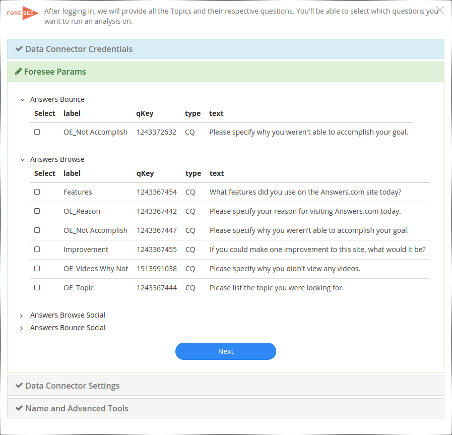

Gmail
~~~~~~

Gmail allows you to connect with a Gmail account and enter a query that will pull data matching the query.

.. image:: gmail.png

Google Analytics
~~~~~~~~~~~~~~~~~

Google Play Developer
~~~~~~~~~~~~~~~~~~~~~~~~

Intercom
~~~~~~~~~~

JIRA
~~~~~~

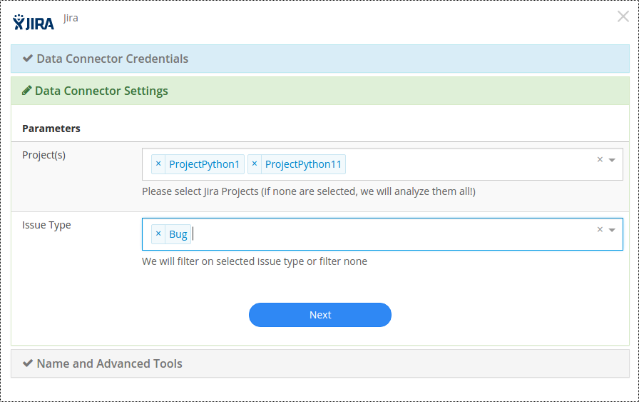

With the JIRA Data Connector, you can select which projects you want to analyze. You can also specify a ticket type if desired. If nothing is specified, Stratifyd will pull all of your JIRA data.

Livechat
~~~~~~~~~~~

The LiveChat connector allows you to select a date range and the type of user you want to analyze chats for: Agent, Visitor, or both.

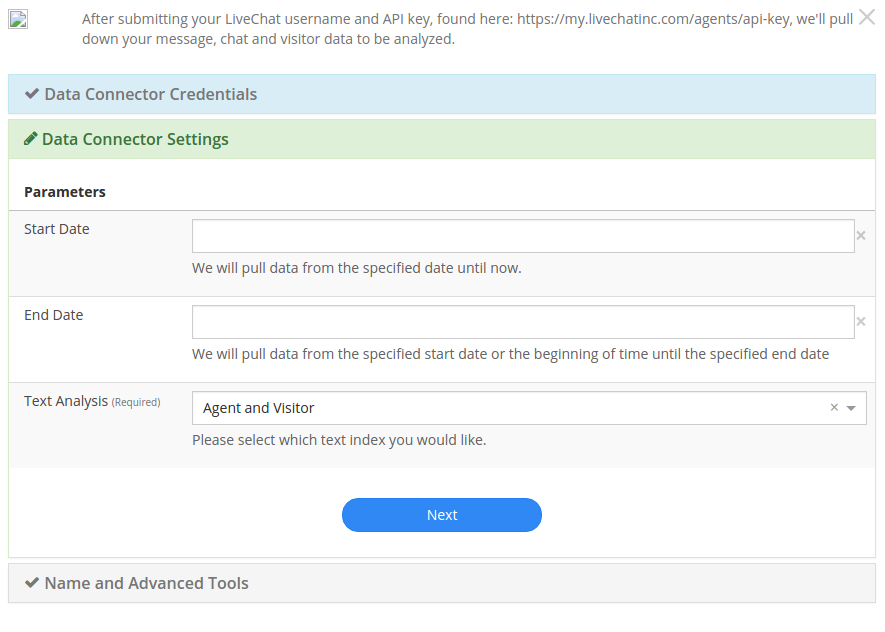

salesforce
~~~~~~~~~~

.. image:: salesforce.png

Slack
~~~~~~~

SurveyGizmo
~~~~~~~~~~~~~

Surveymonkey
~~~~~~~~~~~~~~

.. image:: surveymonkey.png

Trello
~~~~~~~

UserVoice
~~~~~~~~~~

The UserVoice data connector requires a login and api key to connect to your uservoice data. The permissions associated with the login correspond with what data will be available through the connector.

.. image:: uservoice.png

Users can specify which objects you want to analyze.

Zendesk
~~~~~~~~

.. _Public Data Connectors:

Public Data Connectors
^^^^^^^^^^^^^^^^^^^^^^^^

Product Reviews & Ratings
--------------------------

+ `iOS Store Reviews`_
+ `Google Play Store Reviews`_
+ `Home Depot Product Reviews`_
+ `Lowes Product Reviews`_
+ `Best Buy Product Reviews`_
+ `Wal Mart Product Reviews`_
+ `Etsy Shop Reviews`_
+ `Etsy Product Reviews`_
+ `Amazon Product Reviews`_

iOS Store Reviews
~~~~~~~~~~~~~~~~~

Track ratings and reviews on any app in the iOS app store. Use Stratifyd's advanced analytics to automatically extract topics and themes and perform text analytics across thousands of reviews.

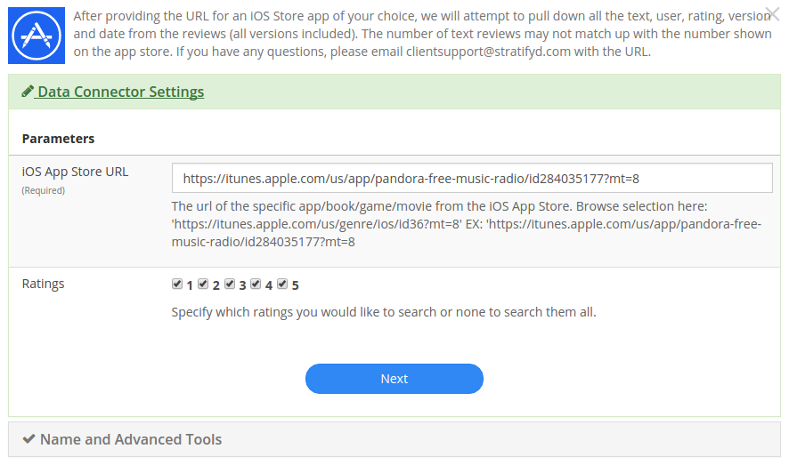

Simply paste the URL of the app you wish to analyze and add it to your dashboard with as many other datasets as you like.

Google Play Store Reviews
~~~~~~~~~~~~~~~~~~~~~~~~~

Track ratings and reviews on any app in the Google Play store. Use Stratifyd's advanced analytics to automatically extract topics and themes and perform text analytics across thousands of reviews.

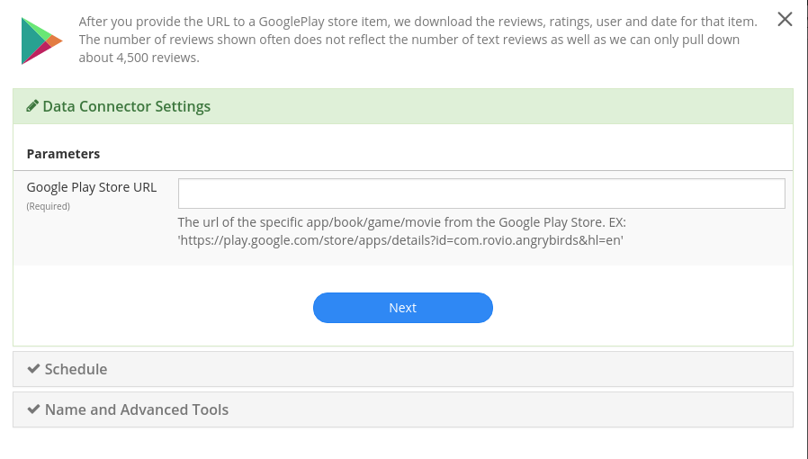

Simply paste the URL of the page you wish to analyze and add it to your dashboard with as many other datasets as you like.

Home Depot Product Reviews
~~~~~~~~~~~~~~~~~~~~~~~~~~

Track ratings and reviews on any products from HomeDepot.com . Use Stratifyd's advanced analytics to automatically extract topics and themes and perform text analytics across thousands of reviews.

.. image:: homedepot.png

Simply paste the URL of the page you wish to analyze and add it to your dashboard with as many other datasets as you like.

Lowes Product Reviews
~~~~~~~~~~~~~~~~~~~~~~~~

Track ratings and reviews on any products from Lowes.com . Use Stratifyd's advanced analytics to automatically extract topics and themes and perform text analytics across thousands of reviews.

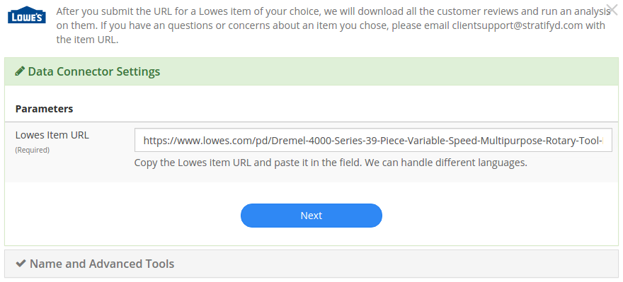

Simply paste the URL of the page you wish to analyze and add it to your dashboard with as many other datasets as you like.

Best Buy Product Reviews
~~~~~~~~~~~~~~~~~~~~~~~~~

Track ratings and reviews on any products from BestBuy.com . Use Stratifyd's advanced analytics to automatically extract topics and themes and perform text analytics across thousands of reviews.

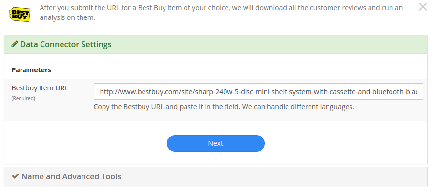

Simply paste the URL of the page you wish to analyze and add it to your dashboard with as many other datasets as you like.

Wal Mart Product Reviews
~~~~~~~~~~~~~~~~~~~~~~~~~

Track ratings and reviews on any products from Walmart.com . Use Stratifyd's advanced analytics to automatically extract topics and themes and perform text analytics across thousands of reviews.

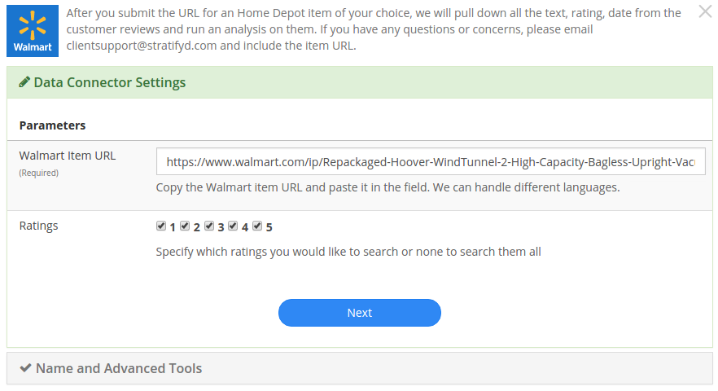

Simply paste the URL of the page you wish to analyze and add it to your dashboard with as many other datasets as you like.

Etsy Shop Reviews
~~~~~~~~~~~~~~~~~~~~~~~~~

Understand customer sentiment about any Etsy shop by automatically collecting shop reviews and visualizing the structured data alongside topics extracted from reviews using unsupervised machine learning.

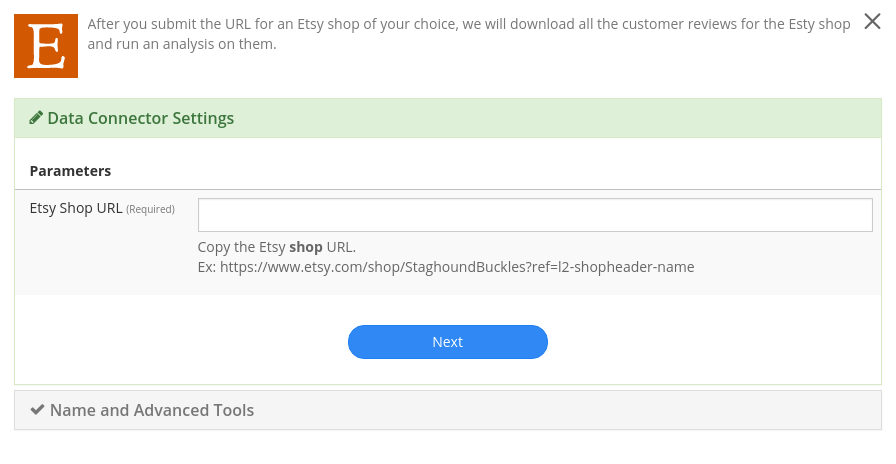

Simply paste the URL of the page you wish to analyze and add it to your dashboard with as many other datasets as you like.

Etsy Product Reviews
~~~~~~~~~~~~~~~~~~~~~~~~~

Track ratings and reviews on any products from Etsy.com . Use Stratifyd's advanced analytics to automatically extract topics and themes and perform text analytics across thousands of reviews.

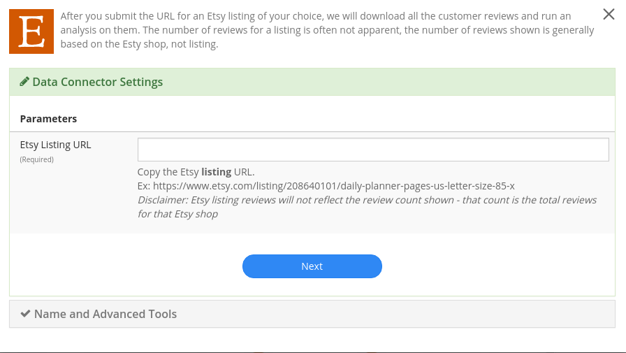

Simply paste the URL of the page you wish to analyze and add it to your dashboard with as many other datasets as you like.

Amazon Product Reviews
~~~~~~~~~~~~~~~~~~~~~~~~~

Track ratings and reviews on any products from Amazon.com . Use Stratifyd's advanced analytics to automatically extract topics and themes and perform text analytics across thousands of reviews.

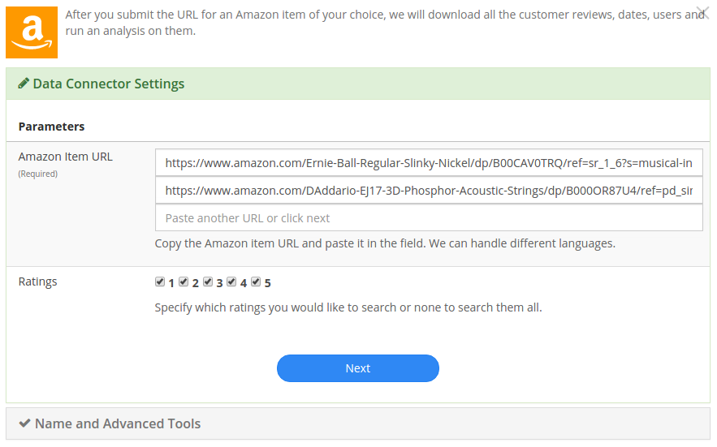

Simply paste the URL of the product page you wish to analyze and add it to your dashboard with as many other datasets as you like.

Social Media
-------------

+ `Twitter`_
+ `Facebook`_
+ `YouTube Comments`_

Twitter
~~~~~~~~~~~~~~~~~~~~~~~~~

Search across millions of tweets to find relevant content. Understand trending topics and sentiment relevant to you on social media.

.. image:: twittersearch.png

Pull tweets from any twitter users to monitor their activity and visualize the trends and sentiment across their feeds.

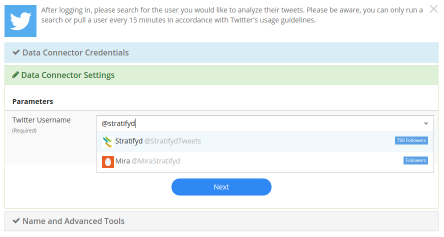

Facebook
~~~~~~~~~~~~~~~~~~~~~~~~~

Pull posts and comments from any public facebook page to analyze comments and social metrics.

.. image:: facebook.png

Simply paste the URL of the page you wish to analyze and add it to your dashboard with as many other datasets as you like.

YouTube Comments
~~~~~~~~~~~~~~~~~~~~~~~~~

Analyze comments from any YouTube video and automatically extract common themes using text analysis.

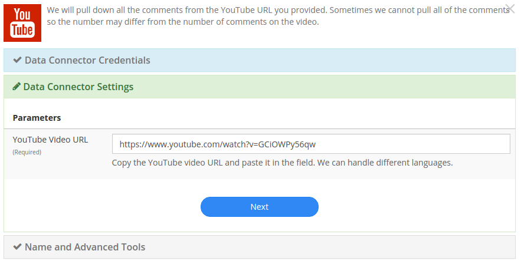

Simply paste the URL of the video you wish to analyze and add it to your dashboard with as many other datasets as you like.

Customer/HR Feedback
---------------------

+ `Consumer Financial Protection Bureau`_
+ `Indeed`_
+ `Consumer Affairs`_

Consumer Financial Protection Bureau
~~~~~~~~~~~~~~~~~~~~~~~~~~~~~~~~~~~~~~~

Explore the CFPB database, full of hundreds of thousands of consumer reports about financial institutions. Compare across products, companies, or consumer issue. Leverage Stratifyd's unsupervised learning to automatically detect topics and trends within the consumer responses.

.. image:: cfpb.png

Simply select the companies or products you wish to analyze. If left blank, Stratifyd will analyze all companies and products in CFPB. Add this data to your dashboard along with as many other datasets as you like.

Indeed
~~~~~~~~~~~~~~~~~~~~~~~~~

Understand employee reviews about any company on indeed.com . Use Stratifyd's unsupervised learning to correlate topics within reviews to employee ratings in categories like Work/Life Balance, Benefits & Compensation, or Job Culture.

.. image:: indeed.png

Simply select the companies you wish to analyze and add it to your dashboard with as many other datasets as you like.

Consumer Affairs
~~~~~~~~~~~~~~~~~~~~~~~~~

Analyze consumer complaints about hundreds of companies on ConsumerAffairs.com . Use Stratifyd's unsupervised learning to correlate automatically extracted topics within reviews to customer ratings or compare across competitors.

.. image:: consumeraffairs.png

Simply select the companies you wish to analyze and add the dataset to your dashboard with as many other datasets as you like.

.. _Stratifyd SDK:

Stratifyd SDK
^^^^^^^^^^^^^^

The Stratifyd SDK should be used to upload files more than 500 MB.

It can also be used to develop custom connections and/or schedule uploads.

We offer a node.js wrapper for our SDK.
https://www.npmjs.com/package/signals-api

To generate an API key:

1. go to Settings in the left-hand menu from the Stratifyd homepage.

2. In the Settings page, click the button to generate an api key towards the bottom.

3. This API key will be generated and downloaded in JSON format to be included in your application.

After the API key has been generated, you can always download it again from the Settings page.

.. image:: apikey.png

The "Revoke" button will immediately invalidate the API key from further use.

.. Note:: API keys can only be generated by authenticated users. All API keys are tied exclusively to a single user account.