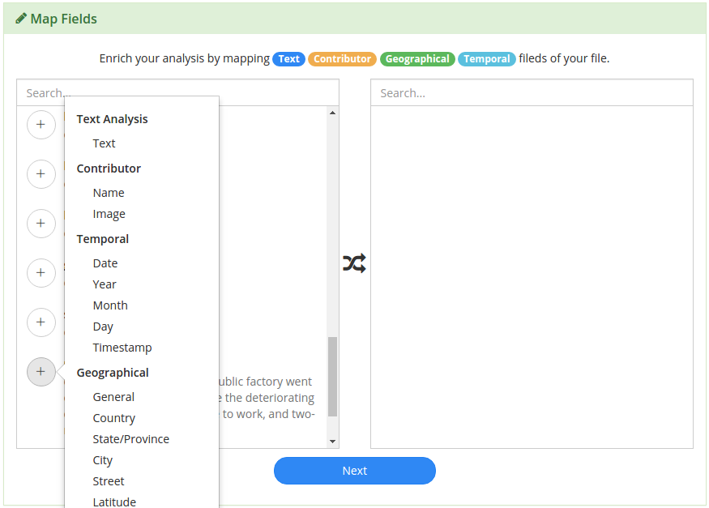
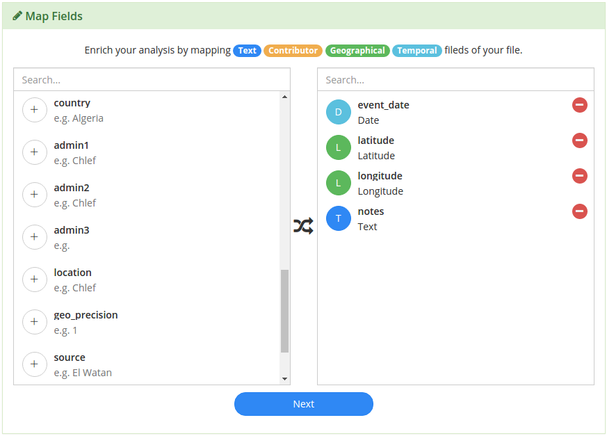

Mapping Data
============

Signals can be used to analyze any type of data; structured or unstructured.

However, there are 4 types of data that Signals treats differently to give users more information. Those data types are:

1) `Textual`_ - e.g. product review, customer feedback, news article text, etc.
2) `Temporal`_ - a date, time, timestamp etc.
3) `Geographical`_ - location, lat/lon, ip address, etc.
4) `Contributor`_ - a 1:1 identifier for the creator of the textual data e.g. name, email, GUID, etc.

Data mapping occurs when a new data source is introduced to the platform. CSV, Excel files, :doc:`enterprisedataconnectors` and *certain* :doc:`3rdpartydataconnectors` require this before analysis.

On the left side of the Map Fields menu, you'll see every field from your data source.
Click on the '+' icon to identify any of the 4 data types mentioned earlier.

When you've identified the fields, click next and this configuration will be used during processing in the Signals Analytics Engine.

Textual
~~~~~~~~~~

The textual data is the data that you want to run unsupervised machine learning to generate buzzwords, a topic model, and sentiment analysis upon. The next section :doc:`signalsanalyticsengine` discusses the outputs of this process.

Temporal
~~~~~~~~~~

Identifying where you temporal data is within your dataset allows the Signals Analytics Engine to normalize dates, allowing you the flexibility to roll-up data on different granularities like yearly, monthly, daily, hourly, etc.

Temporal data can be represented in many different formats:

+ If your data has a field that contains Day, Month, Year, and/or time in any order, you can simply select the "Date" option in the Map Fields menu.

+ If your Day, Month and Year are all contained in separate columns, use the corresponding Map Fields menu items for each to indicate this.

+ If your date is represented in some other format, select "Date" and the Signals Analytics Engine will do a best-guess to normalize the data.

Geographical
~~~~~~~~~~~~~

The Signals Analytics Engine will create a geographical hierarchy based on the input you provide, giving you access to compare your data at any level, whether it's by country, region, or zip code.

If your data contains multiple geographical or spatial data points, you can indicate where that data resides using the Map Fields menu.

Some of the Geographical options are absolute and therefore don't need additional information:

+ For example if your data has a Lat/Long field, Long/Lat field, or one Latitude and one Longitude field, there is no need to specify country, city, or any other geographical information.

+ Same goes for IP address and phone number.

+ Street, City, State, and Country however, are not 100% by themselves, so map as much information as possible if your geographical data is not absolute.

Contributor
~~~~~~~~~~~~

Contributor data is used to tie all the insights back to an individual to help organizations close the loop with their customers.