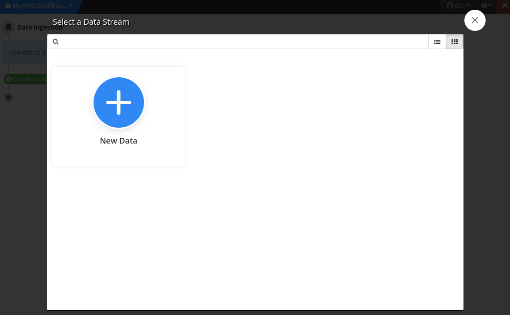

Quick Start Guide
=================

By the end of this section you'll have access to data of your interest, and a dashboard that allows you to analyze and navigate through structured and unstructured data.

Create an account
~~~~~~~~~~~~~~~~~~~~~~

Begin by :doc:`createaccount`. Once you've logged in, check out some of the pre-built public dashboards in the folders on the homepage.

Create your first dashboard
~~~~~~~~~~~~~~~~~~~~~~~~~~~~

To create your own dashboard, click "Create a new Dashboard".

.. image:: newdashboard.png

Choose a template
^^^^^^^^^^^^^^^^^

The template library has a variety of pre-built dashboards to use as a starting point.
If you already have a template you can search for the template in the search bar.
You can always start from a blank dashboard and build your own from scratch.

Connect to data
^^^^^^^^^^^^^^^

Next, you can replace the data in your template with the data you'd like to analyze by clicking replace data, or you can start importing new data sources by clicking on import data.

Select an existing dataset or start with a new dataset.

Connect to your database, upload a CSV or Excel file, or use one of our :ref:`Data Connectors <dataconnector>` for easy access to a wealth of publicly available data. Add as many data source to your dashboard as needed.

.. image:: dataconnectors.png

If you're bringing your own data, specify which fields contain Textual, Temporal, or Geographical information for analysis and normalization. All other fields will be brought in as pivot points and additional visualizations. 

.. image:: csvorexcel.png

.. Note:: See the :doc:`mapdata` guide for more details when uploading CSV or Excel Files

Create visualizations
^^^^^^^^^^^^^^^^^^^^^^^
Your dashboard will contain visualizations based on the type of data in your analysis by default. See the guide on :ref:`processing data` for information on how to interpret these visualizations. Every visualization is clickable, and clicking will apply a filter on your data based on your selection.

.. image:: signalsgif1.gif

Now you're ready to :doc:`widgeteditor` using your other datapoints to home in on interesting segments within your data and discover topics and themes within your textual data.

Find meaningful insights
^^^^^^^^^^^^^^^^^^^^^^^^^^

Let the visualizations guide your analysis. Click on areas of interest to drill-down into subsets of data

Click on the "Data" tab to view the original documents. If you've filtered down to a subset of your data in your dashboard, you'll see only those documents.

For more information see the chapter on :ref:`analyzing data`.

Share your results
~~~~~~~~~~~~~~~~~~~~~

Make your dashboard public or :ref:`share <share>` with colleagues.