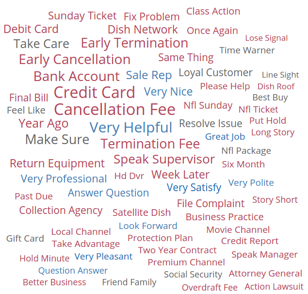
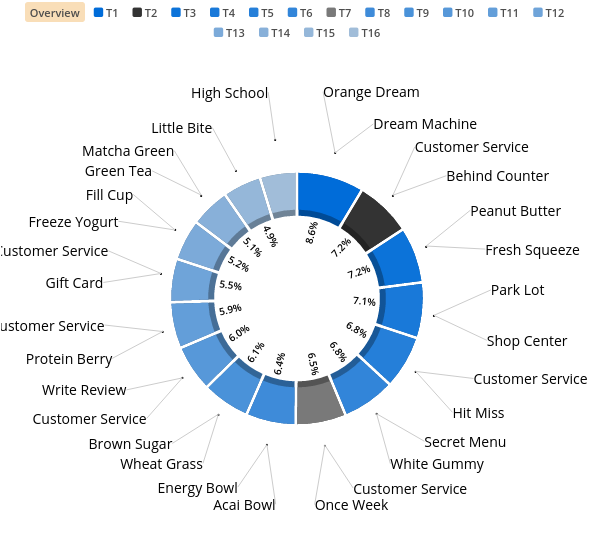
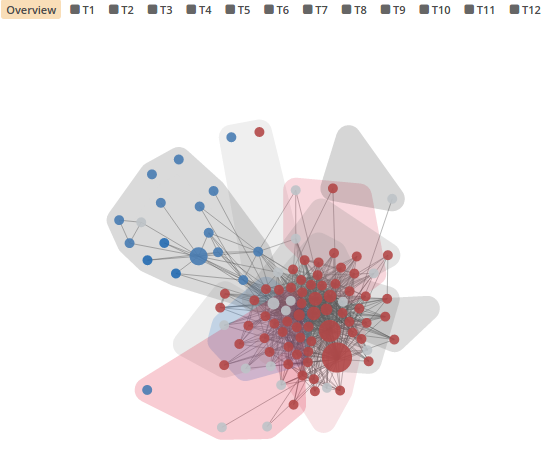
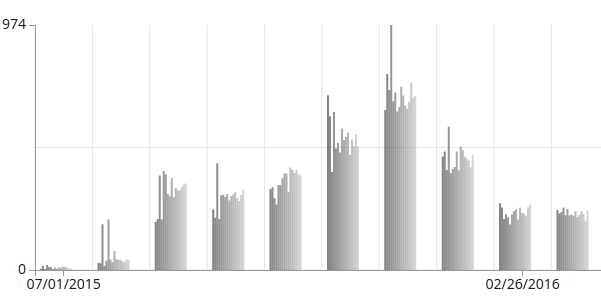

Signals Analytics Engine
========================

This chapter describes what happens when new data is brought into Signals.

The sections below discuss how the output of the Signals Analytics Engine can be accessed and used.

.. Note:: To learn how to tune the analytics engine, see the :doc:`advancedoptions` page.

Data Processing
~~~~~~~~~~~~~~~

The Signals Analytics Engine leverages Machine Learning and Deep Learning algorithms to help navigate and pivot a large set of textual data.

Built on top of our proprietary Bayesian Neural Network and Generative Model, Signals dynamically identifies semantic topic groups based on the context in your input data.

**This is all done in a three-step process:**

1. **The engine starts by performing NLP in over 24 languages.**

  In this step, your input documents are *tokenized* into corresponding `N-Grams`_ (N>=2), *lemmatized* (words with the same root are grouped together e.g. run & ran), *stemmed*, spam/junk and stop words are filtered out, and *part-of-speech* tagging and *named entity extraction* are performed. A large N-Gram-based content network is then created based on your input data files. 

.. _N-Grams: https://en.wikipedia.org/wiki/N-gram

2. **The engine runs a Multi-Model approach on top of the N-Gram-based content network.**

  This includes using our proprietary text analytics algorithms extended from *Bayesian Neural Network*, *Generative Model*, *LSTM (Long Short Term Memory)*, and *Seq2Seq NLU*. In this step, data input is clustered into semantically meaningful groups.

  The groups are generated and visualized by statistical significance (i.e. the percentage attributed to each topic category in the Semantic Topic Visualization). Each topic is tagged with top representative terms in Buzzwords.

3. **Signals automatically processes all geographical (Where), temporal (When), contributor (Who), as well as any other structured data.**

  It joins the data with the N-Gram-based content network for you to pivot and construct analytics questions against your dataset.

As a result, these data types are generated for use in visualizations and analysis:

Buzzwords
~~~~~~~~~
The Buzzwords visualization is made of of every statistically significant N-Gram found in the textual data. In order for an N-Gram to be deemed statistically significant, we look at how often they occur together in the dataset vs. how often they occur individually.

  
  A word-cloud view of N-Grams

.. figure:: buzzwordlist.png

  N-Grams in a detail list visualization

Topics
~~~~~~
The Semantic Topics visualization can be represented in a donut chart or a network graph. Each topic is represented by the N-Grams that make up the topic (which is generated using the process outlined above). We typically show the top two N-Grams for each topic because they often indicate what kind of content is in the topic.
Any document can occur in more than one topic, therefore the % of documents contained in each topic will add up to > 100%

  Semantic Topics from Jamba Juice Yelp Reviews

  Semantic Topics represented in a network graph of related N-Grams

Temporal Trends
~~~~~~~~~~~~~~~

Temporal information accompanying structured and unstructured data is paramount in understanding quantitative events and their potential underlying relationships across disparate data sets. Signals utilizes time-series predictive analysis, deep learning, and event analysis to uncover trends and patterns across structured and unstructured data.

  Topic Model trended over time. Each smaller bar represents a topic while the bar groups represent a time period.

Contributors
~~~~~~~~~~~~
description of contributors