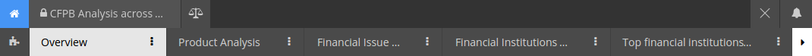

Dashboard Tabs
==============

A dashboard can contain as many or as few tabs as desired. Tabs are there to help the designer organize visualizations into logical or intuitive groups based on the analysis context.

To add a tab, simply click the |newtab| button in the tab menu:

.. |newtab| image:: newtab.png
  :scale: 70

Options can be set at a tab level by hovering over the menu icon on your tab:

.. image:: taboptions.png

Clicking on the edit button will bring up the Tab Detail menu:

.. image:: tabdetail.png

By default, the filters from every tab are tied together. Users have the option to set a local query to merge with global queries or to override global queries with a local query. In next chapter, :doc:`analysis`, this is discussed in detail.